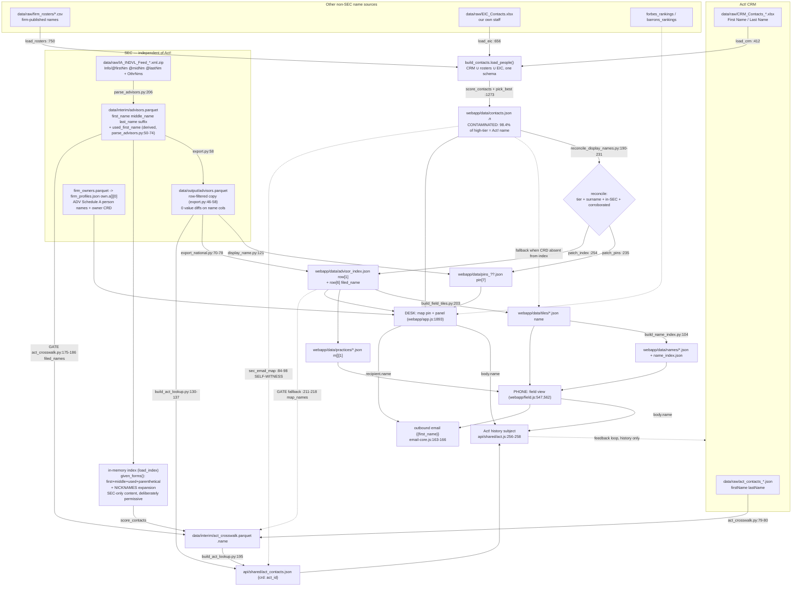

# Advisor name provenance

Where every advisor NAME in this system comes from, what merges into it, and which
fields have Act! (the CRM) somewhere upstream.

Written 2026-08-24 against the working tree. Every claim carries a `file:line`
citation. Every contamination claim is backed by a CRD looked up in the actual
built artifacts, not inferred from code shape. Nothing was modified.

Data snapshot used: `data/interim/advisors.parquet` (436,091 rows),
`data/output/advisors.parquet` (414,784), `webapp/data/contacts.json` (136,395
advisors), `webapp/data/advisor_index.json` (412,567), `data/interim/act_crosswalk.parquet`
(47,466 rows, 26,725 high), `data/raw/act_contacts_2026-08-13.json` (47,466),
`data/raw/CRM_Contacts_2026-06-30.xlsx` (47,426).

---

## 0. Headline corrections to the brief

Three of the four premises hold. One does not, and it matters, because the
current gate is built on it.

**CONFIRMED — `data/interim/advisors.parquet` name fields are pure SEC.**
The only writer is `src/parse_advisors.py:206`, from
`data/raw/IA_INDVL_Feed_*.xml.zip` (`src/parse_advisors.py:202`).
`first_name` / `middle_name` / `last_name` / `suffix` are lifted straight off the
`<Info>` element (`src/parse_advisors.py:108-111`). No other script writes it —
a sweep of every `to_parquet` call in `src/` shows `advisors.parquet` written
once, at `src/parse_advisors.py:206`; `src/apply_overrides.py:87` mutates only
`branch_geocoded_*.parquet` (`src/apply_overrides.py:52`).
`data/output/advisors.parquet` is a row-filtered copy made by
`src/export.py:46-58`; I compared the two frames on all four name columns and
found **0 value differences** across the 414,784 shared CRDs.

**CONFIRMED — `webapp/data/contacts.json` `n` is the pick_best winner and is
routinely the Act! name.** `src/build_contacts.py:1515` writes `n` from the row
that `pick_best` returned (`src/build_contacts.py:1273-1348`); the CRM branch of
the loader builds `name` from the Act! export's `First Name` + `Last Name`
columns (`src/build_contacts.py:412-414`).
*Proof:* of 26,725 high-tier crosswalk rows, **26,300 (98.4%)** have
`contacts.json` `n` byte-identical (case-folded) to the Act! `name` on the same
row. CRD 843291: `contacts.json` `n` = `"Marlyn Campbell"`, `src` = `"CRM"`; the
Act! pull carries `firstName: "Marlyn", lastName: "Campbell"` on contact id
`6e044ab6-9c38-412f-ab8d-137a193d88e2`; the Excel export row 29512 is
`Marlyn | Campbell | wayne.campbell@lpl.com`.

**CONFIRMED (by a different route than stated) — `webapp/data/advisor_index.json`
can adopt a CRM-chosen name.** See §3 and §5. But *not* for CRD 843291, and not
by "adopting" a name in the general case.

**WRONG — the in-memory index from `build_contacts.load_index()` is NOT
Act!-contaminated.** For CRD 843291 it carries `{'wayne', 'marlyn'}` — I computed
`given_forms()` on that row directly and got exactly that set — but **both tokens
come from `advisors.parquet`**: `first_name = WAYNE`, `used_first_name = MARLYN`.
`given_forms()` reads only `last_name` parentheticals, `first_name`,
`middle_name`, `used_first_name` and a hardcoded nickname table
(`src/forbes_match.py:187-214`), all sourced from `advisors.parquet` at
`src/forbes_match.py:289-292`. `used_first_name` is parsed from the individual's
own Form U4 `<OthrNms>` in the SEC feed by `src/parse_advisors.py:50-74`, called
at `src/parse_advisors.py:113`. The repo already states this explicitly:
`scripts/gate_eval.py:217-232` — *"used_first_name is not a CRM field and does
not come from Act!"*.

The comment at `src/act_crosswalk.py:249-250` — "CRD 843291 carries BOTH 'wayne'
(the filing) and 'marlyn' (from the CRM)" — is therefore factually wrong, as is
`src/act_crosswalk.py:228-231` ("reconcile_display_names.py can adopt a CRM name
… CRD 843291 … displays as Marlyn Campbell"). `reconcile_display_names.py`
*skips* 843291: the published first token `marlyn` equals `used_first_name`, so
it falls into `skipped["not_in_sec"]` at `src/reconcile_display_names.py:201-203`
and returns without changing anything. The Marlyn display comes from
`src/display_name.py:121`, which prefers `used_first_name` — i.e. from the SEC
feed.

Consequence: the index is not a *contaminated* witness, it is a *permissive* one
(it deliberately unions every alias plus nickname expansions so a CRM name can
find its advisor). That is still the wrong instrument for a check, but the fix is
different — and the current gate's decision to exclude `used_first_name`
(`src/act_crosswalk.py:178`) is now demoting people the SEC itself vouches for.
CRD 843291 is currently `tier = "review"`, `demoted = "first name disagrees with
the SEC record"` in `data/interim/act_crosswalk.parquet`, while the project's own
hand-labelled truth set says the pair is **SAME**, on independent email evidence
(`data/interim/gate_truth.csv`, row for 843291: `label = SAME`,
`evidence_channel = email`, evidence "Act! email wayne.campbell@lpl.com … SEC
filing WAYNE CAMPBELL [files also as MARLYN] -- agrees").

---

## 1. Every file and field that holds an advisor name

Act!-influence column: **yes** = an Act! value can change what this field says;
**selection** = every candidate value is SEC-supplied but Act! chose which one;
**no** = Act! cannot reach it.

### Raw inputs

| File | Field(s) | Written by | Fed from | Act! / roster influence |
|---|---|---|---|---|
| `data/raw/IA_INDVL_Feed_*.xml.zip` | `Info/@firstNm @midNm @lastNm @sufNm`, `OthrNms/OthrNm` | SEC bulk feed | SEC | **no** — regulator's own file |
| `data/raw/act_contacts_*.json` | `firstName`, `middleName`, `lastName`, `fullName`, `namePrefix`, `nameSuffix`, `salutation` | `src/act_client.py` (Act! Web API pull) | Act! | **yes, by definition** — this IS Act! |
| `data/raw/CRM_Contacts_*.xlsx` | `First Name`, `Last Name`, `Contact` | manual Act! export | Act! | **yes, by definition** |
| `data/raw/EIC_Contacts.xlsx` | `Name` | manual, EIC's own directory | EIC | **no** (but not SEC either — hand-typed) |
| `data/raw/firm_rosters/*.csv` | per-firm name column (`name`, `faName`, `MarketingName`, `full_name`, …) | the `*_async.py` scrapers | firm websites | roster **yes**, Act! **no** |
| `data/raw/forbes_rankings.json`, `barrons_rankings.json` | published advisor name | `src/forbes_harvest.js`, `src/barrons_harvest.js` | Forbes / Barron's | ranking-scrape **yes**, Act! **no** |

### Interim tables

| File | Field(s) | Written by | Fed from | Act! / roster influence |
|---|---|---|---|---|
| `data/interim/advisors.parquet` | `first_name`, `middle_name`, `last_name`, `suffix` | `src/parse_advisors.py:206` | SEC `<Info>` (`:108-111`) | **no** |
| `data/interim/advisors.parquet` | `used_first_name` | `src/parse_advisors.py:206` | SEC `<OthrNms>` via heuristic `_used_first` (`:50-74`) | **no**, but *derived* — see §6 |
| `data/output/advisors.parquet` | same four + `used_first_name` | `src/export.py:58` | row-filtered copy of the above (`src/export.py:46-57`) | **no** — verified 0 value diffs |
| `data/interim/act_crosswalk.parquet` | `name` | `src/act_crosswalk.py:324` | Act! `firstName`+`lastName` (`src/act_crosswalk.py:79-80`) | **yes** — it is the Act! name |
| `data/interim/forbes_rankings.parquet`, `forbes_matches.parquet` | `advisor_name` | `src/parse_forbes.py:148`, `src/forbes_match.py:549` | Forbes scrape | ranking-scrape **yes** |
| `data/interim/barrons_rankings.parquet` | `advisor_name` | `src/parse_barrons.py:105` | Barron's scrape | ranking-scrape **yes** |
| `data/interim/firm_owners.parquet` | `owner_name` (+ `owner_crd`) | `src/fetch_firm_owners.py:200` | ADV Schedule A/B | **no** — SEC filing |
| `data/interim/gate_truth.csv` | `name` (Act!), `first_name`/`middle_name`/`last_name`/`used_first_name` (SEC), `label` | `scripts/gate_label.py` | crosswalk + `advisors.parquet` + Act! email/phone | mixed, columns kept separate; the *label* is Act!-name-free by construction (`scripts/gate_label.py:185`) |
| `data/output/sec_individuals.xlsx` | `full_name`, `legal_name` | `src/export_individuals.py:139-155` | `advisors.parquet` only | **no** |
| `data/output/crm_crd_review.xlsx` | `act_name`, `sec_full_name`, `sec_legal_name` | `src/export_crm_review.py:274-300` | crosswalk (Act!) + `export_individuals.build()` (SEC) | mixed, columns kept separate |

### Webapp artifacts (what the desk shows)

| File | Field | Written by | Fed from | Act! / roster influence |
|---|---|---|---|---|
| `webapp/data/contacts.json` (+ `contacts_base/_0.._3.json`) | `advisors[crd].n` | `src/build_contacts.py:1515`, sharded at `:1424` | `pick_best` winner over CRM ∪ rosters ∪ EIC (`:1273`, `:1365-1368`) | **yes** — 98.4% of high-tier rows equal the Act! name |
| `webapp/data/contacts.json` | `teams[k].n`, `practices[k].n` | `src/build_contacts.py:1500`, `:1606` | CRM `Company` / roster `team` column | **yes**, but these are team/firm names, not personal names |
| `webapp/data/pins_??.json` | `pins[i][7]` | `src/export_geojson.py:249-252`, written `:358` | `display_name(first, last, used)` from `advisors.parquet` | **no** at write time |
| `webapp/data/pins_??.json` | `pins[i][7]` | **patched** by `src/reconcile_display_names.py:235-251` | decision made from `contacts.json` (`:175`, `:190-231`) | **selection**, and **yes** on the `shortens_used` route |
| `webapp/data/advisor_index.json` | `advisors[i][1]` (search/display name) | `src/export_national.py:322` via `_advisor_name` (`:70-78`), written `:346` | `display_name()` from `advisors.parquet` | **no** at write time |
| `webapp/data/advisor_index.json` | `advisors[i][1]`, `advisors[i][6]` | **patched** by `src/reconcile_display_names.py:254-275` | `contacts.json` `n`/`e`/`pu` | **selection** (1,327 rows), **yes** on 27 rows |
| `webapp/data/advisor_index.json` | `advisors[i][6]` ("filed as") | `src/export_national.py:331` via `filed_name` (`src/display_name.py:127-133`) | `advisors.parquet` first/middle/last | **no** at write time; overwritten on reconciled rows (`reconcile_display_names.py:269`) |
| `webapp/data/firm_profiles.json` | `profiles[crd].own.a[i][0]` = owner person name, `[i][6]` = owner CRD | `src/export_firm_profiles.py:199` via `load_owners` (`:73-96`) | `firm_owners.parquet` → ADV Schedule A | **no** |
| `webapp/data/owner_roles.json` | — | `src/export_firm_profiles.py:243-246` | — | holds CRDs + interned titles only, **no names** |
| `webapp/data/barrons.json`, `forbes.json` | no name field, but `barrons_url` / Forbes profile URL contain a name slug | `src/export_barrons.py`, `src/export_forbes.py` | ranking scrapes | ranking-scrape **yes** (slug only) |

### Field-app artifacts (what the phone shows)

| File | Field | Written by | Fed from | Act! / roster influence |
|---|---|---|---|---|
| `webapp/data/tiles/*.json` | `rows[i][name]` | `src/build_field_tiles.py:203` | `advisor_index.json` name, **falling back to `contacts.json` `n`** | **selection**; **yes** on the fallback (`:203`) |
| `webapp/data/tile_index.json` | — | `src/build_field_tiles.py:249-252` | column contract only | n/a |
| `webapp/data/names/*.json`, `name_index.json` | `rows[i][name]`, `rows[i][alt]` | `src/build_name_index.py:104-112`, `:150` | tile `name` + `NICKNAMES` expansion (`:88-92`) | inherits the tile's provenance |
| `webapp/data/practices/*.json` | `[key].m[i][1]` = teammate name | `src/build_field_tiles.py:285-288` | `advisor_index.json` name, falling back to `contacts.json` `n` | same as tiles |
| `data/dev_dialer.json` | `events[i].name` | dev fixture for `/api/log` | whatever the client sent | inherits the desk/phone display name |

### API artifacts

| File | Field | Written by | Fed from | Act! influence |
|---|---|---|---|---|
| `api/shared/act_contacts.json` | **no names** — `contacts` is `{crd: act_id}` | `src/build_act_lookup.py:195-204` | high-tier crosswalk rows | n/a (but see §5 for how rows are *selected*) |
| `api/shared/act_mail_codes.json` | **no names** — addresses → mail code | `src/build_act_mail_codes.py` | Act! custom field `email__y_n` | n/a |
| `api/shared/act.js` (runtime) | `USERS[...]` = Act! *user* (rep) names | `api/shared/act.js:204-211` | Act! users endpoint | rep names, not advisor names |
| Act! history subject (write-back) | `"<purpose> — <body.name>"` | `api/shared/act.js:256-258` | `body.name` sent by the client | **the desk's display name is written INTO Act!** — see §4 |
| outbound email `{{first_name}}` | `api/shared/email-core.js:163-166` | recipient object from the client | `webapp/email.js:1440` ← tile/contacts name | inherits the display name |

---

## 2. How a name flows

---

## 3. Independent witnesses: safe and not safe

The question being answered: *when validating an Act!→CRD match, which name can
stand as a witness that Act! did not itself supply?*

### SAFE

| Field | Why | Citation |
|---|---|---|
| `data/interim/advisors.parquet` `first_name`, `middle_name`, `last_name`, `suffix` | Written once, from the SEC XML, by the only writer in the repo. No merge, no patch, no in-place mutation. | writer `src/parse_advisors.py:206`; values `src/parse_advisors.py:108-111`; feed `src/parse_advisors.py:202` |
| `data/output/advisors.parquet` same fields | Row-filtered copy only. Verified: 0 value differences vs interim on `first_name`, `middle_name`, `last_name`, `used_first_name` across 414,784 CRDs. | `src/export.py:46-58` |
| `data/interim/advisors.parquet` `used_first_name` | Parsed from the individual's own Form U4 `<OthrNms>` in the same SEC zip. Not a CRM field. The repo says so at length. | `src/parse_advisors.py:50-74`, called `:113`; `scripts/gate_eval.py:217-232` |
| `firm_owners.parquet` `owner_name` + `owner_crd`, surfaced as `firm_profiles.json` `own.a[i][0]` / `[i][6]` | ADV Schedule A/B — the firm's filing, with a CRD attached. Independent of Act! and of the individual feed. Covers ~9,992 mapped advisors only. | `src/fetch_firm_owners.py:200`; `src/export_firm_profiles.py:73-96`, `:199`, `:220-246` |
| Roster-published names, `data/raw/firm_rosters/*.csv` | Scraped from firm websites. Independent of Act!. Not SEC, so it is a *second* witness, not the authority. | `src/build_contacts.py:750-757` |
| Forbes / Barron's published names | Independent third-party publications. `barrons_rankings.parquet` even carries a publisher-supplied `advisor_crd`. | `src/parse_barrons.py:105`; `src/parse_forbes.py:148` |
| The Act! record's **firm-issued email local part** | A field held *in* Act!, but its value is assigned by the advisor's firm, not typed as a name by EIC. This is the project's own labelling channel, and its rationale is written down. Weaker than SEC: a mis-keyed contact carries the wrong mailbox, and generic domains are excluded for exactly that reason. | `scripts/gate_label.py:12-15`, `:184-200`; `scripts/gate_eval.py:340-359` (rule c) |
| The Act! `businessPhone` matched against a firm roster | A direct line appearing against exactly one person on the firm's own site names that person. Branch/switchboard lines excluded. | `scripts/gate_label.py:16-19`, `:210-231` |
| `data/interim/gate_truth.csv` `label` | Labelled by construction without ever reading the Act! name field. 493 rows, 199 UNKNOWN — the unknown rate is reported rather than guessed. | `scripts/gate_label.py:1-27`, `:185` |

### NOT SAFE

| Field | Why not | Citation | Proof |
|---|---|---|---|
| `webapp/data/contacts.json` `advisors[crd].n` | Whichever row won `pick_best`; for a CRM-sourced contact that IS the Act! name. | `src/build_contacts.py:1515`, `:1273-1290`, `:412-414` | 26,300 of 26,725 high-tier crosswalk rows have `n` == the Act! `name`. CRD 843291: `n`="Marlyn Campbell", `src`="CRM"; Act! contact `6e044ab6-…` is `firstName: Marlyn`. |
| `webapp/data/contacts.json` `advisors[crd].e` | Same field, same problem — the winning row's email. Used by `build_act_lookup` as if it were the SEC's address. | `src/build_contacts.py:1516`; consumed `src/build_act_lookup.py:84-98` | 23,923 of 26,725 high-tier rows have `contacts.json` `e` byte-identical to the Act! `email` on the crosswalk row (89.5%). |
| `webapp/data/advisor_index.json` `advisors[i][1]` | Base value is pure SEC (`src/export_national.py:70-78` → `src/display_name.py:116-124`), but `reconcile_display_names.py` patches it using `contacts.json`, whose `n`/`e`/`pu` may be Act!-supplied. | patch `src/reconcile_display_names.py:254-275`; decision `:190-231` | **1,327** index rows differ from `display_name(first, last, used)` recomputed from `advisors.parquet`. Of those, **341** have a CRM-sourced `contacts.json` record — e.g. CRD 2300079: SEC display "Mohammad Akbar" → index "Masud Akbar", `src`="CRM"; CRD 2070222: "Eftin Andraos" → "John Andraos", `src`="CRM". **27** rows carry a first name absent from the SEC record entirely (the `shortens_used` route, `src/reconcile_display_names.py:224-231`), e.g. CRD 2920499 "Ray Gonzalez" (SEC RAMON / CASTILLO / RAYMOND), `src`="CRM". |
| `webapp/data/advisor_index.json` `advisors[i][6]` ("filed as") | Pure SEC where untouched, but on reconciled rows it is overwritten with `"{used} {last}"`, so it stops being the filing. | `src/reconcile_display_names.py:269`; base `src/export_national.py:331` | CRD 843291: row[6] = "Wayne Campbell" (correct, untouched). On a reconciled row it is the *replaced display name*, not the legal name. |
| `webapp/data/pins_??.json` `pin[7]` | Same patch, same source. | `src/reconcile_display_names.py:235-251` | CRD 843291 pin in `pins_NJ.json` reads "Marlyn Campbell". |
| `webapp/data/tiles/*.json` `name`, and everything derived from it (`names/*.json`, `name_index.json`, `practices/*.json`) | Takes `advisor_index.json`, but falls back to `contacts.json` `n` when the CRD is absent from the index — an explicit `or` on one line. | `src/build_field_tiles.py:203`, `:285-288`; `src/build_name_index.py:104-112` | CRD 843291 tile row (`tiles/160_-300.json`) reads "Marlyn Campbell". |
| The in-memory index from `build_contacts.load_index()` | **Not contaminated by Act!** — but still unusable as a check, because it is built to be *permissive*: it unions `first_name`, `middle_name`, `used_first_name`, surname parentheticals **and** a nickname expansion, so nearly any plausible given name agrees with something. | `src/build_contacts.py:1405-1410`; `src/forbes_match.py:187-214`, `:289-292` | `given_forms()` on CRD 843291 returns exactly `{'marlyn','wayne'}`; both are columns of `advisors.parquet` (`first_name=WAYNE`, `used_first_name=MARLYN`). Nothing from the CRM. |
| `data/interim/act_crosswalk.parquet` `name` | It is the Act! name, carried for review. Never a witness. | `src/act_crosswalk.py:79-80`, `:302-304` | — |
| Anything a rep sees on screen, as a witness for a match | The desk and phone display names are the *output* of the merge; using them to validate the merge is circular. They are also written back into Act! history (§4). | `webapp/app.js:1893`; `webapp/field.js:547,562`; `api/shared/act.js:256-258` | — |

---

## 4. Additional name sources and paths not in the brief

1. **`data/raw/EIC_Contacts.xlsx`** — a *third* contact loader beside CRM and
   rosters, feeding the same `name` column into `pick_best`.
   `src/build_contacts.py:637-687`, name at `:656`. 16 EIC colleagues, hand-typed,
   neither SEC nor Act!. Small, but it can win `pick_best` and set `contacts.json`
   `n`.

2. **`data/interim/firm_owners.parquet` → `webapp/data/firm_profiles.json`
   `own.a[][0]`** — person names from ADV Schedule A/B, carrying `owner_crd` at
   index 6 (`src/export_firm_profiles.py:73-96`, `:199`). This is a genuine
   SEC-independent-of-the-individual-feed witness with a CRD attached, and
   nothing currently uses it for match validation. Example, CRD 6037378:
   `"Lierman, William, Joseph"` under firm CRD 175112.

3. **Forbes / Barron's published names** — `advisor_name` in
   `forbes_rankings.parquet`, `forbes_matches.parquet`, `barrons_rankings.parquet`.
   Barron's supplies its own `advisor_crd` column. Third-party, unusable-by-Act!,
   and again not used as a witness.

4. **`scripts/gate_label.py` / `data/interim/gate_truth.csv`** — a 493-row
   hand-labelled truth set built specifically so the gate can be scored on
   evidence that is not the Act! name, plus `scripts/gate_eval.py` which runs five
   candidate gates against it. The production gate is rule `a`
   (`scripts/gate_eval.py:411`, "today's gate: filing first/middle, unsplit").
   Anchor case 843291 is labelled `demote` in `ANCHORS`
   (`scripts/gate_eval.py:56`) but `SAME` in the generated truth file — the two
   disagree, which is itself worth resolving.

5. **A fourth self-witness, not on the list — `src/build_act_lookup.py`.**
   `sec_email_map()` calls `contacts.json` `e` "the address the FIRM publishes"
   (`src/build_act_lookup.py:84-98`) and hands it to `given_names_disagree()` as
   the SEC side (`:187-188`). For 89.5% of high-tier rows that value is
   byte-identical to the Act! email on the same row, so `ours & theirs` is
   non-empty, the function returns `False`, and the namesake drop is skipped.
   By construction it compares Act! against Act!, one file further along than the
   three already identified.
   **Currently dormant, not currently harmful:** I evaluated it over the live
   crosswalk and it fires on 0 rows, because the upstream gate in
   `act_crosswalk.py` has already demoted every high-tier pair whose Act! name
   disagrees with the filed name. It becomes live the moment that gate is
   loosened. Note also that the `filed` map in the same function IS clean — it
   reads `data/output/advisors.parquet` (`src/build_act_lookup.py:130-137`).

6. **A write-back loop into Act!** — the display name the rep sees is posted into
   the Act! history subject as `"<purpose> — <body.name>"`
   (`api/shared/act.js:256-258`), where `body.name` is the desk's
   `p.n || c.n` (`webapp/app.js:1893`) or the phone's tile name
   (`webapp/field.js:547,562`). It lands in history text, **not** in the contact's
   `firstName`/`lastName`, so it does not currently re-contaminate the name field
   — but it does mean an EIC-chosen name is now printed on the CRM record a human
   reads. The same display name reaches advisors directly as `{{first_name}}` in
   outbound email (`webapp/email.js:1440` → `api/shared/email-core.js:163-166`).

7. **A dead audit check.** `src/audit.py:99-111` carries the correct reasoning in
   its comment (switch from `contacts.json` to `advisor_index.json` so the check
   is not Act! against Act!) but builds `adv` as `{crd: {"n": name}}` from
   `advisor_index.json` and then reads `v.get("wk")` — a key that object never
   has. `seen` is always empty, `unknown` is always empty, and
   *"phone_kind values are all in the taxonomy"* passes unconditionally. The
   name-provenance fix appears to have been pasted over a check about phone kinds.
   (`src/audit.py:106-111`.) The real display-name consistency check is separate
   and does work: `src/audit.py:488-530`.

8. **`given_crd` bypasses the name gate entirely.** A roster that publishes its
   own advisors' CRDs produces `tier = "confirmed"` with `score = 1.0` and no name
   comparison at all (`src/build_contacts.py:988-999`). `act_crosswalk.py`
   declares the same field for Act! (`src/act_crosswalk.py:94`) but Act! holds no
   CRD today, so this is a roster-side path only.

9. **`src/nicknames.py`** is a hardcoded table extending
   `forbes_match.NICKNAME_GROUPS` (`src/nicknames.py:48-51`). No per-record Act!
   influence — but its author states the additions include *"the handful that
   appear in Act!'s own data"* (`src/nicknames.py:48`). That is a curation-time
   influence on what counts as agreement, worth knowing when the table is the
   arbiter of a safety gate.

---

## 5. What the gate is actually doing today

`src/act_crosswalk.py:255-264`, in order:

1. `filed_names` — `advisors.parquet` `first_name` + `middle_name` only
   (`:175-186`). **Clean witness.** `used_first_name` is deliberately excluded,
   on a rationale (`:249-250`) that is wrong: that field is SEC, not CRM.
2. `sec_tokens` — the in-memory index (`:158-161`). **Clean but permissive**;
   reached only when (1) is empty.
3. `map_names` — `advisor_index.json` (`:211-218`). **Contaminable**, per §3.
   Reached only when (1) and (2) are both empty.
4. `return True` — no evidence, no demotion (`:264`).

So the *live* comparison for anyone in `advisors.parquet` is clean. The residual
risk is confined to CRDs the parquet does not carry, and the residual *cost* is
the opposite failure: correct pairs demoted because the SEC's own `used_first_name`
was excluded. CRD 843291 is currently sitting in `review` for exactly that reason
while the project's own truth set labels it SAME.

---

## 6. Uncertainty, stated as uncertainty

- **`used_first_name` is SEC-sourced but not SEC-verbatim.** It is chosen from a
  noisy, unranked `<OthrNms>` list by a two-rule heuristic
  (`src/parse_advisors.py:50-74`), whose own docstring notes the list also holds
  bare initials, maiden names and near-duplicates. It is not Act!-influenced, but
  it is an EIC-authored inference over SEC data, not a filed field. Treating it as
  "the filing" and treating it as "contaminated" are both wrong.
- **I did not verify the SEC XML directly.** The purity argument for
  `advisors.parquet` rests on the parser reading only the zip and on there being
  no second writer in the repo. Manual edits to the parquet outside version
  control would be invisible to this analysis; I found no evidence of any.
- **Whether "Marlyn" or "Wayne" is the right thing to show for CRD 843291** is a
  product question this document does not settle. What is settled is that both
  names come from the SEC feed, and that no Act! value is involved.
- **The 341 CRM-driven `advisor_index` rows are mostly benign** (Johnny→John,
  William→Bill) and every one of them picks a name the SEC already carries. The 27
  `shortens_used` rows are the only ones where a name absent from the SEC record
  reaches the desk. I have not audited all 27 for correctness.
- **`scripts/gate_eval.py` ANCHORS says 843291 should be demoted;
  `data/interim/gate_truth.csv` labels it SAME.** I did not resolve which is
  intended. The truth file's evidence string is specific and checkable; the anchor
  is a one-line assertion.
- **The `given_names_disagree` self-witness fires on 0 rows today.** That is a
  measurement of the current artifacts, not a proof that it cannot fire.
